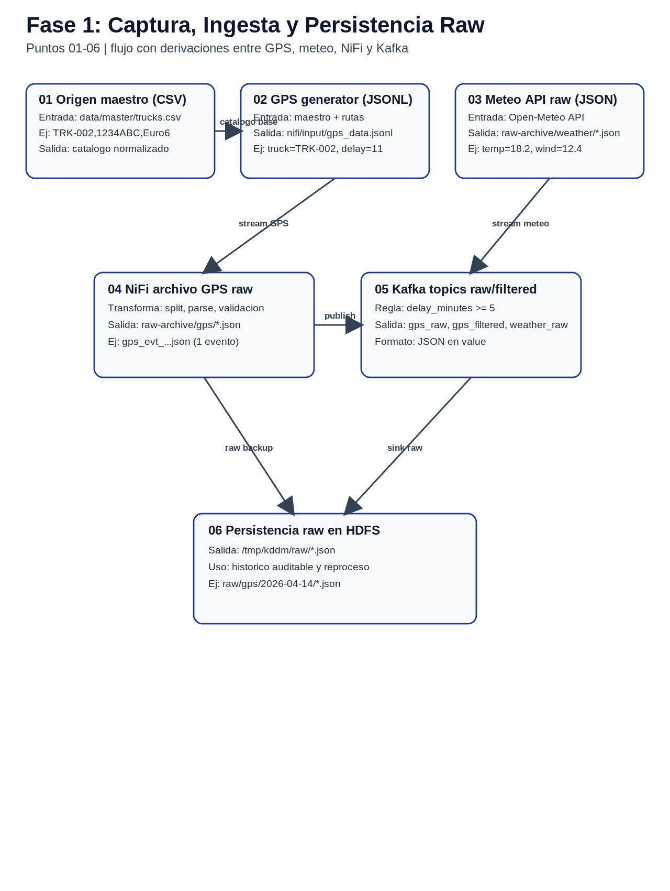
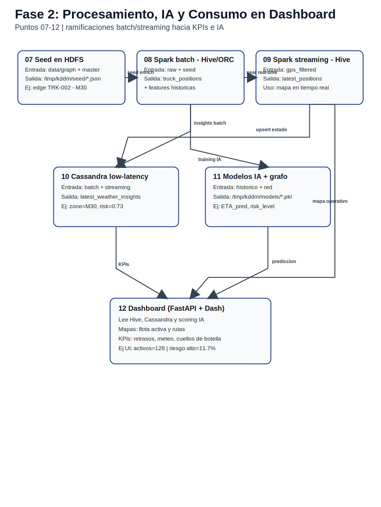

# Trazabilidad del Dato - Resumen para Comité de Dirección
## Plataforma KDD Logística

Fecha: 14/04/2026  
Versión: 1.0 (ejecutiva)

---

## 1) Mensaje clave para dirección
La plataforma dispone de trazabilidad completa del dato desde origen hasta decisión operativa en dashboard, con evidencias técnicas reproducibles, controles de calidad en streaming y mecanismos de resiliencia para continuidad del servicio.

En términos de negocio, esto permite:
1. Visibilidad operativa en tiempo casi real de flota, clima y red logística.
2. Priorización de cuellos de botella con analítica de grafo.
3. Recomendaciones predictivas de riesgo de retraso para anticipar incidencias.
4. Gobierno del dato con capacidad de auditoría punto a punto.

---

## 2) Flujo ejecutivo del dato
### Fase 1 - Captura, ingesta y persistencia raw

### Fase 2 - Procesamiento, IA y consumo en dashboard

Resumen del recorrido:
1. Captura de datos (GPS + clima + maestros).
2. Ingesta y enrutado (NiFi/Kafka).
3. Persistencia raw (HDFS) y procesamiento (Spark batch/streaming).
4. Publicación analítica (Hive), operativa de baja latencia (Cassandra) y modelo IA.
5. Consumo final en dashboard para mapas, estadísticas, rutas e IA.

---

## 3) Qué se controla y por qué es relevante

### 3.1 Controles de calidad del dato
1. Dedupe por identificador de evento (`event_id`, `weather_event_id`).
2. Watermark de 20 minutos para eventos tardíos.
3. Ventanas de 15 minutos para agregados comparables.
4. Normalización de tipos y timestamps en Spark.

Impacto negocio: métricas más estables y menor ruido operacional.

### 3.2 Controles de resiliencia
1. Fallback a Parquet si Hive no está disponible en streaming.
2. Fallback de lectura de dashboard a ficheros NiFi si Cassandra no responde.
3. Persistencia de estado de reentreno IA para continuidad funcional.

Impacto negocio: continuidad de servicio y menor riesgo de ceguera operativa.

---

## 4) Fuentes que alimentan la toma de decisiones

### 4.1 Mapas y operación diaria
- Fuente principal: `transport.vehicle_latest_state` (Cassandra).
- Resultado en UI: posición de flota, velocidad, retraso, ETA.

### 4.2 Estadísticas operativas
- Fuentes: `delay_metrics_streaming`, `weather_observations_streaming` y vistas Madrid.
- Resultado en UI: KPIs de retraso/velocidad/impacto meteo.

### 4.3 Optimización de rutas y red
- Fuentes: grafo logístico + insights históricos.
- Resultado en UI: mejor ruta, rutas alternativas, cuellos de botella, nodos críticos.

### 4.4 IA predictiva
- Fuente: dataset enriquecido + contexto meteo/congestión.
- Resultado en UI: scoring de riesgo (`low/medium/high`) y estado de reentreno.

---

## 5) Riesgos actuales y mitigación

1. Riesgo: indisponibilidad temporal de Cassandra.
Mitigación: fallback de lectura desde fuentes NiFi.

2. Riesgo: incompatibilidad puntual de escritura Hive en streaming.
Mitigación: escritura alternativa en Parquet (`/data/curated/*_streaming`).

3. Riesgo: duplicidad por reintentos de ingesta.
Mitigación: deduplicación en Spark antes de persistir.

---

## 6) Indicadores recomendados para cuadro de mando de dirección

1. Freshness flota: tiempo desde último evento (`vehicle_latest_state`).
2. Cobertura de datos: número de vehículos con estado válido.
3. Delay medio por almacén y tendencia horaria.
4. Severidad meteo y correlación con retrasos.
5. Top cuellos de botella por impacto en red.
6. Rendimiento del modelo IA (RMSE y tasa de riesgo alto).

---

## 7) Decisiones sugeridas al Comité

1. Aprobar este esquema de trazabilidad como estándar de gobierno del dato logístico.
2. Establecer un SLA formal de freshness para operación (p. ej. < 15 min).
3. Consolidar un cuadro de mando directivo con los 6 indicadores anteriores.
4. Programar revisión mensual de desempeño IA y deriva de modelo.

---

## 8) Evidencia técnica completa
Para auditoría detallada y demostración técnica punto a punto:
- Documento completo: [data-lineage-empresa.md](./data-lineage-empresa.md)
- Scripts de evidencia: `scripts/data_lineage/00_run_all.sh` y `01..12`
