# Trazabilidad End-to-End del Dato
## Plataforma KDD Logistica - Documento Ejecutivo y Tecnico

Version: 2.0  
Fecha: 14/04/2026  
Ambito: Ingesta, transformacion, almacenamiento, analitica, grafos/IA y consumo en dashboard

---

## 1) Resumen ejecutivo
Este documento describe de forma auditada como un dato logistico recorre la plataforma desde su captura inicial hasta su visualizacion en mapas, estadisticas operativas y componentes de IA.

El recorrido esta estructurado en 12 puntos de control, y en cada punto se documenta:
1. De donde sale el dato.
2. Como se transforma.
3. Donde se guarda.
4. En que formato queda.
5. Un ejemplo real de entrada y de salida.
6. Un script para demostrarlo en vivo.

---

<div style="page-break-before: always;"></div>

## 2) Flujo general (vision de direccion)

### Fase 1 - Captura, ingesta y persistencia raw


<div style="page-break-after: always;"></div>

### Fase 2 - Procesamiento, IA y consumo en dashboard


---

## 3) Matriz de linaje (12 puntos auditables)

| Punto | Origen | Transformacion principal | Destino | Formato destino | Script de evidencia |
|---|---|---|---|---|---|
| 01 | `data/master`, `data/graph` | Normalizacion catalogos | Spark + Dashboard | CSV (fuente) | `scripts/data_lineage/01_origen_maestros_locales.sh` |
| 02 | `gps-generator` | Emision continua de telemetria | `nifi/input` | JSONL | `scripts/data_lineage/02_ingesta_gps_nifi_input.sh` |
| 03 | Open-Meteo | Extraccion NiFi de campos meteo | `nifi/raw-archive/weather` | JSON | `scripts/data_lineage/03_ingesta_weather_nifi_raw_archive.sh` |
| 04 | NiFi GPS flow | Split + parse + nombre unico UUID | `nifi/raw-archive/gps` | JSON por evento | `scripts/data_lineage/04_nifi_raw_archive_gps.sh` |
| 05 | NiFi PublishKafka | Enrutado raw/filtered | Kafka topics | JSON en `value` | `scripts/data_lineage/05_kafka_topics_raw_y_filtrados.sh` |
| 06 | `raw-hdfs-loader` | Sincronizacion con timestamp | HDFS raw NiFi | JSON/JSONL | `scripts/data_lineage/06_hdfs_raw_nifi.sh` |
| 07 | Seed local | Carga inicial HDFS | HDFS raw/master/graph | JSONL + CSV | `scripts/data_lineage/07_hdfs_seed_batch_input.sh` |
| 08 | Spark batch | Limpieza + enriquecimiento + grafos + ML | Hive + HDFS modelo | Tablas Hive + artefacto | `scripts/data_lineage/08_hive_batch_grafo_ml.sh` |
| 09 | Spark streaming | Parse + watermark + dedupe + ventanas | Hive streaming + Cassandra | Tablas Hive/Cassandra | `scripts/data_lineage/09_hive_streaming_y_vistas_madrid.sh` |
| 10 | Spark + dashboard backend | Persistencia operacional | Cassandra | CQL tables | `scripts/data_lineage/10_cassandra_operacional.sh` |
| 11 | Pipeline ML | Seleccion modelo por RMSE | HDFS + Hive scoring | Modelo + tabla scoring | `scripts/data_lineage/11_modelo_ia_y_artifacto_hdfs.sh` |
| 12 | APIs dashboard | Filtros/routing/KPIs | Frontend visual | JSON API -> UI | `scripts/data_lineage/12_dashboard_fuentes_y_consumo.sh` |

---

## 4) Trazabilidad detallada por punto (con evidencia real)

### Punto 01 - Datos maestros y topologia de red
**Grafico Punto 01 (entrada -> transformacion -> salida)**


- Fuente: `data/master/warehouses.csv`, `data/master/vehicles.csv`, `data/graph/vertices.csv`, `data/graph/edges.csv`
- Ejemplo real entrada: `MAD,Madrid Hub,ES,South Europe,high,40.4168,-3.7038`
- Ejemplo real salida (campo normalizado): `warehouse_id=MAD`, `warehouse_name=Madrid Hub`, `criticality=high`
- Script: `scripts/data_lineage/01_origen_maestros_locales.sh`

### Punto 02 - Ingesta GPS inicial
**Grafico Punto 02 (entrada -> transformacion -> salida)**


- Fuente: `gps-generator`
- Formato salida: JSONL
- Ejemplo real entrada: `vehicle_id=TRUCK-009`, `delay_minutes=11`, `event_time=2026-04-13T21:48:32Z`
- Ejemplo real salida: fichero `gps_20260413T214832Z.jsonl` en `nifi/input`
- Script: `scripts/data_lineage/02_ingesta_gps_nifi_input.sh`

### Punto 03 - Ingesta meteorologica raw
**Grafico Punto 03 (entrada -> transformacion -> salida)**


- Fuente: Open-Meteo via NiFi
- Formato salida: JSON
- Ejemplo real entrada: `temperature_2m=18.7`, `wind_speed_10m=5.6`
- Ejemplo real salida: snapshot en `nifi/raw-archive/weather/*`
- Script: `scripts/data_lineage/03_ingesta_weather_nifi_raw_archive.sh`

### Punto 04 - Raw GPS archivado por NiFi
**Grafico Punto 04 (entrada -> transformacion -> salida)**


- Fuente: flujo GPS NiFi
- Formato salida: JSON por evento
- Ejemplo real salida: `gps_..._77890958-707f-46cc-944c-986dc36b2f1d.jsonl`
- Script: `scripts/data_lineage/04_nifi_raw_archive_gps.sh`

### Punto 05 - Bus Kafka raw y filtered
**Grafico Punto 05 (entrada -> transformacion -> salida)**




- Topics: `transport.raw`, `transport.filtered`, `transport.weather.raw`, `transport.weather.filtered`
- Transformacion clave: enrutado por regla de retraso
- Script: `scripts/data_lineage/05_kafka_topics_raw_y_filtrados.sh`

### Punto 06 - Raw NiFi en HDFS
**Grafico Punto 06 (entrada -> transformacion -> salida)**


- Destino HDFS: `/data/raw/nifi/gps`, `/data/raw/nifi/weather`
- Objetivo: trazabilidad y reproceso raw
- Script: `scripts/data_lineage/06_hdfs_raw_nifi.sh`

### Punto 07 - Seed batch en HDFS
**Grafico Punto 07 (entrada -> transformacion -> salida)**


- Entrada batch oficial Spark: `hdfs://hadoop:9000/data/raw/gps_events.jsonl`
- Script: `scripts/data_lineage/07_hdfs_seed_batch_input.sh`

### Punto 08 - Spark batch: enriquecimiento, grafos e IA
**Grafico Punto 08 (entrada -> transformacion -> salida)**




- Tablas Hive de salida: `enriched_events`, `delay_metrics_batch`, `route_graph_metrics`, `route_shortest_paths`, `ml_delay_risk_scores`
- Ejemplo transformado: `event_time` string -> `event_timestamp` tipado
- Script: `scripts/data_lineage/08_hive_batch_grafo_ml.sh`

### Punto 09 - Spark streaming operacional
**Grafico Punto 09 (entrada -> transformacion -> salida)**


- Controles tecnicos: watermark 20 minutos, dedupe por `event_id` y `weather_event_id`
- Vistas de negocio: `v_delay_metrics_streaming_madrid`, `v_weather_observations_madrid`
- Script: `scripts/data_lineage/09_hive_streaming_y_vistas_madrid.sh`

### Punto 10 - Cassandra de baja latencia
**Grafico Punto 10 (entrada -> transformacion -> salida)**


- Tablas operativas: `vehicle_latest_state`, `weather_observations_recent`, `network_insights_snapshots`, `model_retrain_state`
- Script: `scripts/data_lineage/10_cassandra_operacional.sh`

### Punto 11 - Modelo IA y scoring
**Grafico Punto 11 (entrada -> transformacion -> salida)**


- Criterio de seleccion: menor RMSE en test
- Artefacto final: `hdfs://hadoop:9000/models/delay_risk_rf`
- Script: `scripts/data_lineage/11_modelo_ia_y_artifacto_hdfs.sh`

### Punto 12 - Consumo final dashboard
**Grafico Punto 12 (entrada -> transformacion -> salida)**




- Fuentes preferidas dashboard: Cassandra
- Fallback dashboard: `nifi/input` y `nifi/raw-archive/weather`
- Script: `scripts/data_lineage/12_dashboard_fuentes_y_consumo.sh`

---

## 5) Datos relevantes adicionales para direccion

### 5.1 Controles de calidad y consistencia ya implementados
1. Dedupe por identificador de evento (`event_id`, `weather_event_id`).
2. Watermark de 20 minutos para tolerancia a eventos tardios.
3. Ventanas de 15 minutos para KPIs operativos consistentes.
4. Vistas de negocio en zona horaria Madrid (`from_utc_timestamp`).
5. Fallback de persistencia a Parquet si Hive no esta disponible.
6. Fallback de lectura dashboard a ficheros NiFi si Cassandra cae.

### 5.2 Indicadores de salud operativa recomendados
1. Freshness de flota (`vehicle_latest_state`) menor de 900 segundos.
2. Presencia de tablas clave en `transport_analytics`.
3. Disponibilidad de topics Kafka esperados.
4. Existencia de artefacto de modelo en `/models/delay_risk_rf`.

### 5.3 Riesgos y mitigaciones
1. Riesgo: caida temporal de Cassandra.
   Mitigacion: fallback de lectura a ficheros NiFi en dashboard.
2. Riesgo: incompatibilidad temporal Hive metastore.
   Mitigacion: fallback a Parquet en rutas `/data/curated/*_streaming`.
3. Riesgo: duplicados por reintentos en ingesta.
   Mitigacion: dedupe en Spark por claves de evento.

---

## 6) Guia de demostracion ejecutiva (10-15 min)

1. Ejecutar `./scripts/data_lineage/01_origen_maestros_locales.sh` y mostrar origen maestro.
2. Ejecutar `./scripts/data_lineage/02_ingesta_gps_nifi_input.sh` y `03_ingesta_weather_nifi_raw_archive.sh`.
3. Ejecutar `./scripts/data_lineage/05_kafka_topics_raw_y_filtrados.sh` para evidenciar bus de eventos.
4. Ejecutar `./scripts/data_lineage/08_hive_batch_grafo_ml.sh` para evidenciar valor analitico y de IA.
5. Ejecutar `./scripts/data_lineage/10_cassandra_operacional.sh` para latencia operacional.
6. Ejecutar `./scripts/data_lineage/12_dashboard_fuentes_y_consumo.sh` para cierre visual de negocio.

Ejecucion completa automatica:

```bash
./scripts/data_lineage/00_run_all.sh
```
