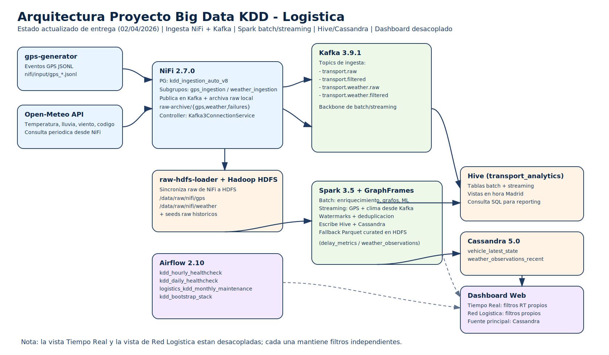

# Arquitectura del Proyecto

## Portada

- Proyecto: `Proyecto Big Data KDD - Logistica`
- Documento: `Arquitectura tecnica actual`
- Version: `v1.0-entrega`
- Fecha: `30/03/2026`

## Indice

1. Vista general
2. Diagrama de arquitectura
3. Componentes y responsabilidades
4. Flujo de datos end-to-end
5. Capas de almacenamiento
6. Decision de desacople en dashboard

## 1. Vista general

La plataforma implementa el ciclo KDD completo en local con Docker Compose:

1. Ingesta dual (GPS + clima) en NiFi.
2. Bus de eventos en Kafka (raw y filtered).
3. Persistencia raw en HDFS (sincronizacion desde raw-archive NiFi).
4. Procesamiento batch y streaming con Spark.
5. Explotacion analitica en Hive + estado operativo en Cassandra.
6. Orquestacion y healthchecks con Airflow.
7. Dashboard web con vistas de Tiempo Real y Red Logistica desacopladas.

## 2. Diagrama de arquitectura

Archivo de imagen:

- `docs/architecture-diagram.svg`

## 3. Componentes y responsabilidades

- `gps-generator`
  - Genera eventos GPS en `nifi/input/gps_*.jsonl`.
  - Mantiene estado de trayectos en `nifi/input/.vehicle_path_state.json`.

- `NiFi 2.7.0`
  - PG principal: `kdd_ingestion_auto_v8`.
  - Subgrupos: `gps_ingestion`, `weather_ingestion`.
  - Publica eventos a Kafka y archiva raw local (`raw-archive`).

- `Kafka 3.9.1`
  - Topics:
    - `transport.raw`
    - `transport.filtered`
    - `transport.weather.raw`
    - `transport.weather.filtered`

- `raw-hdfs-loader` + `Hadoop HDFS`
  - Sincronizan raw local de NiFi a:
    - `/data/raw/nifi/gps`
    - `/data/raw/nifi/weather`

- `Spark 3.5 + GraphFrames`
  - Batch: enriquecimiento, agregaciones, grafos, shortest paths y ML.
  - Streaming: GPS y clima desde Kafka con watermark + deduplicacion.
  - Persistencia en Hive y Cassandra (con fallback Parquet curated).

- `Hive`
  - Almacen analitico SQL (`transport_analytics`).
  - Tablas batch + streaming y vistas en hora Madrid.

- `Cassandra`
  - Estado de baja latencia:
    - `transport.vehicle_latest_state`
    - `transport.weather_observations_recent`

- `Airflow`
  - `kdd_hourly_healthcheck`
  - `kdd_daily_healthcheck`
  - `kdd_bootstrap_stack`
  - `logistics_kdd_monthly_maintenance`
  - El bootstrap ejecuta `scripts/ensure_hive_streaming_compat.sh` para asegurar vistas/tablas streaming.

- `Dashboard`
  - Fuente principal: Cassandra.
  - Fallback controlado a ficheros NiFi para vehiculos/clima.
  - Filtros desacoplados por vista.

## 4. Flujo de datos end-to-end

1. `gps-generator` y `Open-Meteo` alimentan NiFi.
2. NiFi publica a Kafka (raw y filtered) y deja copia raw local.
3. `raw-hdfs-loader` mueve raw a HDFS.
4. Spark streaming consume filtered y escribe Hive/Cassandra.
5. Spark batch recalcula historicos, grafos y modelo ML.
6. Dashboard consulta principalmente Cassandra para operacion.

## 5. Capas de almacenamiento

- `Raw (Bronze)`
  - JSON/JSONL original sin transformar.
  - Ejemplo: `/data/raw/nifi/...`

- `Curated (Silver/Gold)`
  - Parquet + tablas Hive para consulta eficiente.
  - Ejemplo: `/data/curated/...` y `transport_analytics.*`

## 6. Decision de desacople en dashboard

Se adopta desacople intencional para reducir ambiguedad operativa:

- `Operacion en Tiempo Real` usa filtros `Origen RT` / `Destino RT`.
- `Analisis de Red Logistica` usa `Origen` / `Destino` / `Perfil`.

Un cambio en una vista no altera la otra.
