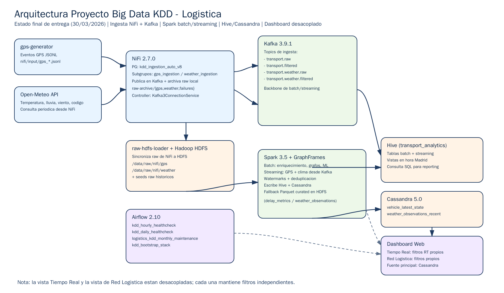
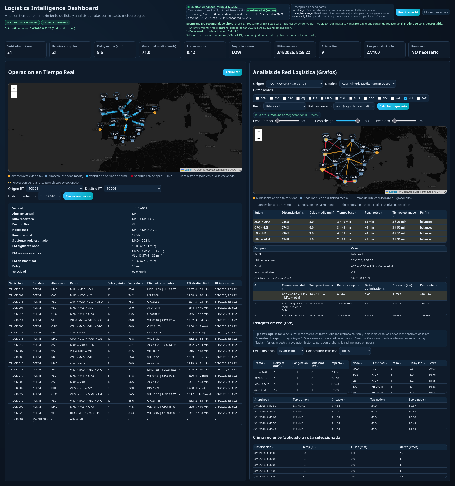

# Memoria Tecnica del Sistema KDD Logistico

## Portada

- Proyecto: `Proyecto Big Data KDD - Logistica`
- Documento: `Memoria tecnica del sistema`
- Version: `v1.3`
- Fecha: `03/04/2026`
- Repositorio GitHub: `https://github.com/raulsistemasydesarrollo/KDD-Ingenieria-de-datos`

## Indice

1. Objetivo del sistema
2. Arquitectura general
3. Flujo de datos end-to-end
4. NiFi en detalle
5. Generacion y sincronizacion raw
6. Spark en detalle
7. Hive: tablas y vistas
8. Cassandra
9. Airflow en detalle
10. Dashboard
11. Orquestacion de arranque y reset
12. Operacion y validacion recomendada
13. Puntos de resiliencia implementados
14. Limitaciones conocidas

Documento de entrega con explicacion detallada del funcionamiento extremo a extremo del sistema: ingesta, procesamiento batch/streaming, almacenamiento, orquestacion y visualizacion.

Resumen ejecutivo asociado (1-2 paginas):

- `docs/resumen-ejecutivo-memoria.md`

## 1. Objetivo del sistema

El sistema implementa un ciclo KDD para analitica logistica, combinando:

- ingesta continua de GPS y meteorologia,
- procesamiento batch y streaming con Spark,
- analitica de red con grafos (GraphFrames),
- scoring de riesgo de retraso con ML,
- persistencia en Hive/HDFS y Cassandra,
- monitorizacion/orquestacion con Airflow,
- visualizacion web en dashboard.

## 2. Arquitectura general

Componentes principales del `docker-compose`:

1. `kafka` (Apache Kafka 3.9.1): bus de eventos.
2. `nifi` (Apache NiFi 2.7.0): ingesta y enrutamiento.
3. `gps-generator`: generador de eventos GPS simulados.
4. `hadoop`: HDFS + YARN (nodo unico pseudo-distribuido).
5. `raw-hdfs-loader`: sincroniza raw de NiFi hacia HDFS.
6. `hive-metastore` + `hive-server`: catalogo y consulta SQL.
7. `spark-client`: ejecucion de jobs Spark (batch y streaming).
8. `cassandra`: estado mas reciente por vehiculo para baja latencia.
9. `airflow-webserver` + `airflow-scheduler` + `airflow-postgres`: orquestacion.
10. `dashboard`: API HTTP + frontend para operacion y analitica visual.

### Diagrama de arquitectura



Archivo fuente del diagrama:

- `docs/architecture-diagram.png`

## 3. Flujo de datos end-to-end

### 3.1 GPS

1. `gps-generator` crea ficheros `gps_*.jsonl` en `nifi/input`.
2. NiFi lee esos ficheros, extrae atributos y publica:
   - `transport.raw` (todos los eventos),
   - `transport.filtered` (eventos con `delay_minutes >= 5`).
3. NiFi archiva raw local en `nifi/raw-archive/gps`.
4. `raw-hdfs-loader` mueve esos raw a HDFS: `/data/raw/nifi/gps/...`.
5. Spark streaming consume `transport.filtered`, agrega ventanas y escribe:
   - `transport_analytics.delay_metrics_streaming` (Hive),
   - `transport_analytics.enriched_events_streaming` (Hive),
   - fallback Parquet: `/data/curated/delay_metrics_streaming`.

### 3.2 Meteorologia

1. NiFi consulta Open-Meteo periodicamente.
2. NiFi extrae y normaliza campos de clima.
3. NiFi publica:
   - `transport.weather.raw`,
   - `transport.weather.filtered`.
4. NiFi archiva raw local en `nifi/raw-archive/weather`.
5. `raw-hdfs-loader` sincroniza a HDFS: `/data/raw/nifi/weather/...`.
6. Spark streaming consume `transport.weather.filtered` y escribe:
   - vista operativa de consulta: `transport_analytics.v_weather_observations_madrid`,
   - fallback Parquet: `/data/curated/weather_observations_streaming`.

### 3.3 Batch historico

1. Spark batch lee `hdfs://hadoop:9000/data/raw/gps_events.jsonl`.
2. Limpia/normaliza y enriquece con maestros de almacenes/vehiculos.
3. Calcula agregados, grafos y modelo ML.
4. Publica tablas analiticas en Hive.

## 4. NiFi en detalle

## 4.1 Estructura visual desplegada

Capturas de referencia de los subflujos:


Bootstrap actual (`scripts/bootstrap_nifi_flow.sh`) crea:

- Process Group principal: `kdd_ingestion_auto_v9`
- Subgrupos:
  - `gps_ingestion`
  - `weather_ingestion`

Esta separacion facilita mantenimiento y lectura en la UI.

## 4.2 Controller Service

- `kafka3_connection_service` (`Kafka3ConnectionService`)
  - `bootstrap.servers = kafka:9092`
  - compartido por procesadores `PublishKafka`.

## 4.3 Flujo GPS: procesadores y rol

1. `list_gps_files` (`ListFile`)
   - dir: `/opt/nifi/nifi-current/input`
   - filtro: `.*\.jsonl`
   - periodo: `15 sec`.
2. `fetch_gps_file` (`FetchFile`)
3. `split_gps_lines` (`SplitText`)
   - `Line Split Count=1`.
4. `extract_gps_fields` (`EvaluateJsonPath`)
   - extrae: `vehicle_id`, `warehouse_id`, `event_type`, `delay_minutes`.
5. `update_gps_archive_name` (`UpdateAttribute`)
   - `filename = ${filename}_${fragment.index}_${UUID()}.jsonl`.
6. `route_gps_filtered` (`RouteOnAttribute`)
   - regla `filtered`: `${delay_minutes:toNumber():ge(5)}`.
7. `publish_gps_raw` (`PublishKafka`)
   - topic: `transport.raw`.
8. `publish_gps_filtered` (`PublishKafka`)
   - topic: `transport.filtered`.
9. `archive_gps_raw_local` (`PutFile`)
   - dir: `/opt/nifi/nifi-current/raw-archive/gps`.
10. `gps_failure_sink` (`PutFile`)
   - dir: `/opt/nifi/nifi-current/raw-archive/failures/gps`.

Ruteo principal:

- `matched` de `extract_gps_fields` pasa por `update_gps_archive_name` antes de archivado local (evita sobrescritura por split).
- `filtered` de `route_gps_filtered` va a Kafka filtrado.
- Errores y `unmatched` van a `gps_failure_sink`.

## 4.4 Flujo Clima: procesadores y rol

1. `tick_weather` (`GenerateFlowFile`)
   - periodo: `60 sec`.
2. `invoke_weather_api` (`InvokeHTTP`)
   - URL Open-Meteo (Madrid).
3. `extract_weather_fields` (`EvaluateJsonPath`)
   - `temperature_c`, `precipitation_mm`, `wind_kmh`, `weather_code`.
4. `update_weather_attrs` (`UpdateAttribute`)
   - `weather_event_id=${UUID()}`
   - `warehouse_id=WH1`
   - `source=open-meteo`
   - `observation_time` en UTC.
5. `attrs_to_weather_json` (`AttributesToJSON`)
   - transforma atributos a JSON final.
6. `publish_weather_raw` (`PublishKafka`)
   - topic: `transport.weather.raw`.
7. `publish_weather_filtered` (`PublishKafka`)
   - topic: `transport.weather.filtered`.
8. `archive_weather_raw_local` (`PutFile`)
   - dir: `/opt/nifi/nifi-current/raw-archive/weather`.
9. `weather_failure_sink` (`PutFile`)
   - dir: `/opt/nifi/nifi-current/raw-archive/failures/weather`.

Ruteo principal:

- `Response` de `InvokeHTTP` alimenta raw Kafka, archivo raw y extraccion.
- Camino normal termina en `publish_weather_filtered`.
- `Failure/Retry/No Retry` y fallos de transformacion/publicacion van a `weather_failure_sink`.

## 4.5 Back-pressure y terminacion

Cada conexion creada por bootstrap aplica:

- `backPressureObjectThreshold = 10000`
- `backPressureDataSizeThreshold = 1 GB`
- `flowFileExpiration = 0 sec`

Ademas, se auto-terminan relaciones no usadas para evitar bloqueos por conexiones obligatorias sin destino.

## 5. Generacion y sincronizacion raw

## 5.1 GPS generator

Script: `scripts/gps_generator.py`.

Caracteristicas:

- Frecuencia: cada `15s`.
- Factor temporal simulado: `SIM_TIME_FACTOR=6`.
- Flota cargada desde `data/master/vehicles.csv` (IDs actuales `TRUCK-*`, filtrando por `status` activo), 1 evento por vehiculo y ciclo.
- Catalogo de rutas realistas calculado desde el grafo logistico y reasignacion dinamica al cerrar tramos.
- Movimiento progresivo entre ciudades (sin salto directo idealizado).
- Estado persistido en `.vehicle_path_state.json` para continuidad de trayectorias.

Campos emitidos por evento:

- `event_id`, `vehicle_id`, `warehouse_id`, `route_id`, `event_type`,
- `latitude`, `longitude`, `delay_minutes`, `speed_kmh`, `event_time`.

## 5.2 Raw HDFS loader

Script: `docker/hadoop/scripts/load-nifi-raw-to-hdfs.sh`.

Funcion:

- Escanea raw local de NiFi (`/opt/nifi-raw/gps`, `/opt/nifi-raw/weather`) cada 30s.
- Sube ficheros a `/data/raw/nifi/{gps|weather}` en HDFS.
- Mueve ficheros procesados a `.processed` local para evitar reprocesado.

## 6. Spark en detalle

Clase principal: `com.proyectobigdata.LogisticsAnalyticsJob`.

Modos:

- `batch` (job historico + grafos + ML)
- `streaming` (consumo continuo de Kafka)
- `insights-sync` (consolidacion de snapshots de insights Cassandra -> Hive)

Lanzadores:

- `spark-app/run-batch.sh`
- `spark-app/run-streaming.sh`
- `spark-app/run-insights-sync.sh`

Paquetes Spark usados:

- `spark-sql-kafka-0-10_2.12:3.5.5`
- `graphframes-spark3_2.12:0.9.0-spark3.5`
- `spark-cassandra-connector_2.12:3.5.1`

## 6.1 Preparacion comun

Al iniciar:

1. Configura Spark SQL timezone (`SPARK_SQL_TIMEZONE`, por defecto `Europe/Madrid`).
2. Habilita soporte Hive (`enableHiveSupport`).
3. Crea DB Hive `transport_analytics` si no existe.
4. Carga maestros Hive:
   - `transport_analytics.master_warehouses`
   - `transport_analytics.master_vehicles`
5. Inicializa esquema Cassandra:
   - keyspace `transport`
   - tabla `transport.vehicle_latest_state`.

## 6.2 Pipeline batch

Entrada:

- `hdfs://hadoop:9000/data/raw/gps_events.jsonl`

Pasos:

1. Limpieza y normalizacion (`cleanAndNormalizeEvents`):
   - `event_time -> event_timestamp`,
   - cast de `delay_minutes`, `speed_kmh`,
   - filtros de nulos clave.
2. Deduplicacion por `event_id`.
3. Enriquecimiento con maestros (`warehouse` + `vehicle`).
4. Persistencia:
   - Parquet curated: `/data/curated/enriched_events`
   - Hive: `transport_analytics.enriched_events`.
5. Agregacion por ventana de 15 min y almacen:
   - Hive: `transport_analytics.delay_metrics_batch`.
6. Grafo (`GraphFrames`):
   - connected components + pagerank
   - Hive: `transport_analytics.route_graph_metrics`.
7. Shortest paths con landmarks de almacenes criticos:
   - Hive: `transport_analytics.route_shortest_paths`.
8. Estado mas reciente por vehiculo a Cassandra.
9. Entrenamiento/scoring ML de retraso:
   - Hive: `transport_analytics.ml_delay_risk_scores`
   - Modelo: `hdfs://hadoop:9000/models/delay_risk_rf`.

## 6.3 Pipeline streaming

Entradas Kafka:

- `transport.filtered` (GPS filtrado)
- `transport.weather.filtered` (meteo filtrada)

Pasos GPS streaming:

1. Parse JSON desde `value`.
2. Limpieza y normalizacion.
3. Watermark de `20 minutes`.
4. Deduplicacion por `event_id`.
5. Enriquecimiento con maestros.
6. Ventana de 15 min por `warehouse_id`.
7. Escritura `foreachBatch` a Hive:
   - `transport_analytics.delay_metrics_streaming`.
   - `transport_analytics.enriched_events_streaming`.
8. Escritura de latest state por vehiculo a Cassandra.

Pasos clima streaming:

1. Parse de campos meteo desde JSON.
2. Limpieza y normalizacion (`weather_timestamp`, casts, filtros).
3. Watermark `20 minutes`.
4. Deduplicacion por `weather_event_id`.
5. Escritura `foreachBatch` a Hive:
   - consumo operativo via vista `transport_analytics.v_weather_observations_madrid`.

Fallback robustez:

- Si falla escritura Hive (incompatibilidad/metastore), guarda en Parquet fallback:
  - `/data/curated/delay_metrics_streaming`
  - `/data/curated/enriched_events_streaming`
  - `/data/curated/weather_observations_streaming`

Checkpoints:

- `/tmp/checkpoints/delay_metrics`
- `/tmp/checkpoints/latest_vehicle_state`
- `/tmp/checkpoints/weather_observations`

Compatibilidad operativa:

- El script `scripts/ensure_hive_streaming_compat.sh` asegura que existan:
  - `transport_analytics.delay_metrics_streaming`
  - `transport_analytics.weather_observations_streaming`
  - vistas Madrid asociadas.
- Se ejecuta en arranque para evitar vistas "colgadas" tras limpiezas.

## 6.4 ML de riesgo de retraso

Modelo principal:

- `RandomForestRegressor`
- estrategia de seleccion:
  - `baseline_rf`: `speed_kmh` + (`warehouse_id`, `vehicle_type`) codificados,
  - `tuned_baseline_rf`: mismas features base con hiperparametros ampliados,
  - `enhanced_rf`: añade `route_id`, `vehicle_id`, `capacity_kg`, `vehicle_status_score`,
    `warehouse_criticality_score`, `distance_to_warehouse_km`, `hour_sin/cos`, `is_weekend`,
    y contexto por almacen de clima (`climate_temperature_c`, `climate_precipitation_mm`, `climate_wind_kmh`, `climate_severity_score`)
    y congestion (`congestion_avg_delay_minutes`, `congestion_avg_speed_kmh`, `congestion_event_count`, `congestion_pressure_score`).
  - El contexto de clima/congestion en `enhanced_rf` se alinea por ventana temporal de 15 minutos (`event_timestamp`).
- label: `delay_minutes`

Logica:

- si dataset >= 3 filas: entrena modelo (con split 80/20 si >=20).
- evalua RMSE en test para los 3 candidatos.
- selecciona automaticamente el modelo con menor RMSE y lo persiste en:
  - `hdfs://hadoop:9000/models/delay_risk_rf`.
- puntua ultimo estado por vehiculo y clasifica riesgo:
  - `high` (>=10)
  - `medium` (>=5)
  - `low` (<5)

Fallback heuristico (si dataset pequeno):

- regla por `speed_kmh` para `predicted_delay_minutes`.

Resultado validado en la iteracion `03/04/2026` (dataset semilla 20k):

- `baseline_rmse=6.1329`
- `tuned_baseline_rmse=6.1343`
- `enhanced_rmse=6.0206`
- modelo seleccionado: `enhanced_rf`.
- tamano de modelo en HDFS: ~`1.2 MB`.

## 7. Hive: tablas y vistas

## 7.1 Tablas maestras y batch

- `transport_analytics.master_warehouses`
- `transport_analytics.master_vehicles`
- `transport_analytics.enriched_events`
- `transport_analytics.delay_metrics_batch`
- `transport_analytics.route_graph_metrics`
- `transport_analytics.route_shortest_paths`
- `transport_analytics.ml_delay_risk_scores`

## 7.2 Tablas streaming

- `transport_analytics.delay_metrics_streaming`
- `transport_analytics.enriched_events_streaming`
- (opcional segun entorno) `transport_analytics.weather_observations_streaming`
- `transport_analytics.network_insights_snapshots_hive`
- `transport_analytics.network_insights_hourly_trends`

## 7.3 Vistas en hora Madrid

Vistas usadas por healthchecks/dashboard:

- `transport_analytics.v_weather_observations_madrid`
- `transport_analytics.v_delay_metrics_streaming_madrid`

Nota operativa:

- Si las tablas streaming fuente no estan disponibles temporalmente, los DAGs de healthcheck degradan a validaciones seguras para no producir falsos rojos.
- En esta entrega, para consultas meteo de operacion se usa `transport_analytics.v_weather_observations_madrid`.

## 8. Cassandra

Keyspace/tablas:

- `transport.vehicle_latest_state`
- `transport.weather_observations_recent`
- `transport.network_insights_snapshots`

Uso:

- mantener ultimo estado por `vehicle_id` para consulta rapida.

Campos:

- `vehicle_id` (PK), `warehouse_id`, `route_id`,
- `last_event_timestamp`, `delay_minutes`, `speed_kmh`,
- `latitude`, `longitude`.

## 9. Airflow en detalle

Captura de referencia del entorno Airflow:


DAGs:

1. `kdd_bootstrap_stack`
   - Manual.
   - Arranca servicios no-Airflow con `docker compose up`.
2. `kdd_hourly_healthcheck` (`@hourly`)
3. `kdd_daily_healthcheck` (`@daily`)
4. `logistics_kdd_monthly_maintenance` (`@monthly`)
   - ejecuta batch Spark y limpia checkpoints temporales.

Healthchecks (hourly/daily):

- contenedores core,
- topics Kafka obligatorios,
- rutas HDFS,
- tablas Hive base,
- vistas Madrid,
- smoke query sobre vistas (con fallback seguro).

Alertas:

- `on_failure_callback` en todos los DAGs,
- opcional email via `AIRFLOW_ALERT_EMAIL`.

## 10. Dashboard

Captura de estado operativo del dashboard:



Backend:

- `dashboard/server.py` (HTTP server multihilo).
- Lee:
  - estado de vehiculo desde Cassandra (`transport.vehicle_latest_state`) como fuente primaria,
  - fallback de GPS desde `nifi/input` si Cassandra no esta disponible,
  - plan de trayecto por vehiculo desde `nifi/input/.vehicle_path_state.json` (`planned_origin`, `planned_destination`),
  - clima reciente desde Cassandra (`transport.weather_observations_recent`) como fuente primaria,
  - fallback de clima con snapshots en `nifi/raw-archive/weather`,
  - grafo y maestros desde `data/graph/*.csv`, `data/master/warehouses.csv`.

API principal:

- `/api/overview`
- `/api/vehicles/latest`
- `/api/vehicles/history`
- `/api/weather/latest`
- `/api/network/graph`
- `/api/network/best-route`
- `/api/network/insights/history`
- `/api/ml/retrain` (POST, trigger de reentreno)
- `/api/ml/retrain/status` (GET, estado + recomendacion)
- `/api/debug/sources` (diagnostico de fuentes activas y fallback)

Motor de ruta:

- Dijkstra en backend con perfiles:
  - `balanced`, `fastest`, `resilient`, `eco`, `low_risk`, `reliable`.
- Peso de arista considera distancia, delay efectivo, congestion, meteo, incertidumbre y pesos multiobjetivo (`time/risk/eco`).
- Soporta exclusiones de nodos (`avoid_nodes`) y modo temporal (`auto`, `peak`, `offpeak`, `night`).
- Devuelve explicabilidad de ruta (`explain`) y metricas de fiabilidad (`on_time_probability`).

Frontend:

- modo oscuro por defecto (toggle claro/oscuro),
- mapa tiempo real y mapa de red logistica,
- tabla de rutas con ETA y desglose de tiempos.
- tablas ordenables por columna.
- filtros desacoplados por vista:
  - Tiempo Real: `Origen RT` / `Destino RT` (solo columna izquierda),
  - Red Logistica: `Origen` / `Destino` / `Perfil` (solo columna derecha).
- selector de `Perfil` ampliado a 6 estrategias (`balanced`, `fastest`, `resilient`, `eco`, `low_risk`, `reliable`).
- controles de optimizacion multiobjetivo:
  - `Peso tiempo`,
  - `Peso riesgo`,
  - `Peso eco`.
- selector de `Patron horario` (`auto`, `peak`, `offpeak`, `night`) y panel `Evitar nodos`.
- bloque de reentreno IA en cabecera:
  - boton `Reentrenar IA`,
  - estado runtime,
  - recomendacion de reentreno con score de deriva y motivos,
  - panel de modelos IA en dos bloques:
    - izquierda: `EN USO` + candidato elegido (`A/B/C`) y comparativa RMSE,
    - derecha: descripcion funcional de los 3 candidatos.
- comportamiento de filtros RT:
  - `TODOS->TODOS` vista global,
  - filtros parciales (`TODOS->X` o `X->TODOS`) soportados.
- reglas de consistencia:
  - no ruta concreta con origen=destino en bloque logistico,
  - limpieza automatica de seleccion de vehiculo si deja de cumplir filtro RT,
  - priorizacion de `planned_origin/planned_destination` + `planned_route_nodes` para evitar rutas `X->X` espurias y proyecciones incoherentes.
  - uso de `planned_route_nodes` para proyectar ruta restante (no nodos ya superados).
  - selectores de origen/destino ordenados alfabeticamente en ambas vistas,
  - etiquetas de nodo RT en formato 3 letras y semitransparentes para no ocultar vehiculos.

## 11. Orquestacion de arranque y reset

Script principal de arranque:

- `scripts/start_kdd.sh`
  - levanta stack,
  - espera NiFi,
  - ejecuta bootstrap NiFi (por defecto `kdd_ingestion_auto_v9`),
  - asegura compatibilidad Hive streaming,
  - repuebla meteo Hive si procede,
  - verifica dashboard.

Reset de demo:

- `scripts/reset_demo_data.sh`
  - limpia eventos locales,
  - resetea estado streaming (Hive + checkpoints),
  - recrea generadores.

## 12. Operacion y validacion recomendada

Arranque:

```bash
./scripts/start_kdd.sh
```

Validacion E2E batch+streaming:

```bash
./scripts/validate_hive_pipeline.sh
```

Estado de reentreno IA (dashboard):

```bash
curl -s http://localhost:8501/api/ml/retrain/status
```

Trigger manual de reentreno IA:

```bash
curl -s -X POST http://localhost:8501/api/ml/retrain \
  -H 'Content-Type: application/json' \
  -d '{"trigger":"manual_dashboard"}'
```

Limpieza runs rojos historicos (healthchecks):

```bash
./scripts/cleanup_airflow_failed_runs.sh --apply
```

Limpieza de Process Groups legacy NiFi:

```bash
./scripts/cleanup_nifi_legacy_pgs.py
```

## 13. Puntos de resiliencia implementados

1. Fallback a Parquet cuando Hive streaming falla.
2. Manejo de excepciones en escritura Cassandra (no bloquea pipeline).
3. Healthchecks Airflow con degradacion segura en smoke queries.
4. Colas de error separadas en NiFi (`failure sinks` GPS/Clima).
5. Separacion visual de flujos NiFi para diagnostico rapido.
6. Reentreno IA no bloqueante en dashboard (worker asincrono + timeout configurable).
7. Recomendacion de reentreno con histeresis y cooldown para evitar ejecuciones innecesarias.

## 14. Limitaciones conocidas

1. El dashboard depende de Cassandra para `/api/vehicles/latest`; si Cassandra cae, usa fallback desde `nifi/input` y puede perderse parte del estado reciente.
2. Si Cassandra no esta disponible, la precision de clima en dashboard pasa a depender del fallback de snapshots en `raw-archive/weather`.
3. En entorno local, tiempos de arranque de NiFi/Spark pueden variar segun recursos.

---

Esta memoria describe el estado tecnico actual del proyecto para entrega academica y operacion reproducible del entorno.
