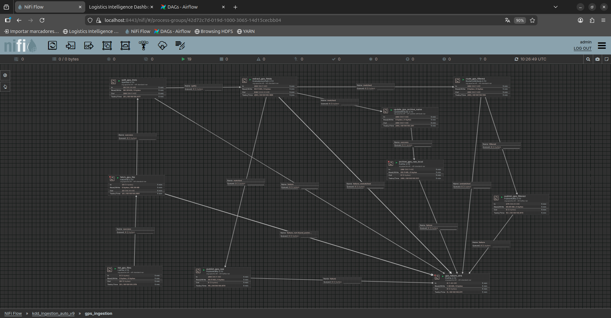
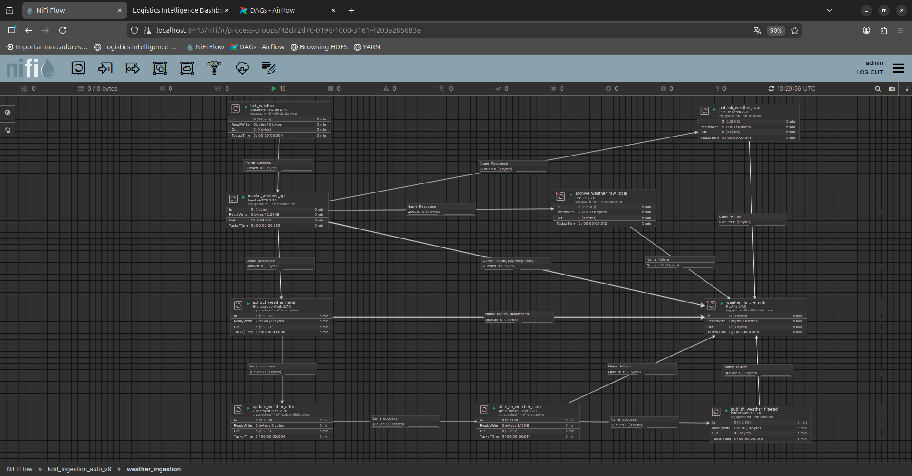

# Flujo NiFi sugerido

## Portada

- Proyecto: `Proyecto Big Data KDD - Logistica`
- Documento: `Flujo NiFi operativo`
- Version: `v1.3`
- Fecha: `03/04/2026`
- Repositorio GitHub: `https://github.com/raulsistemasydesarrollo/KDD-Ingenieria-de-datos`

## Objetivo

Crear una ingesta dual hacia Kafka y HDFS:

- tema `transport.raw`
- tema `transport.filtered`
- tema `transport.weather.raw`
- tema `transport.weather.filtered`
- copia raw en HDFS

## Flujo minimo (GPS)

Captura del subflujo desplegado en NiFi:



1. `ListFile`
   - Directorio: `/opt/nifi/nifi-current/input`
   - Filtro: `*.jsonl`
2. `FetchFile`
3. `SplitText`
   - 1 linea por evento
4. `EvaluateJsonPath`
   - extraer `vehicle_id`, `warehouse_id`, `event_type`, `delay_minutes`
5. `UpdateAttribute`
   - `filename = ${filename}_${fragment.index}_${UUID()}.jsonl`
   - objetivo: evitar sobrescritura en `raw-archive/gps` cuando `SplitText` genera multiples flowfiles desde un mismo archivo.
6. `RouteOnAttribute`
   - `filtered`: `${delay_minutes:toNumber():ge(5)}`
7. `PublishKafka` (NiFi 2.7 con `Kafka3ConnectionService`)
   - Topic raw (todos los GPS): `transport.raw`
8. `PublishKafka` (NiFi 2.7 con `Kafka3ConnectionService`)
   - Topic filtered: `transport.filtered`
9. `PutFile`
   - Directorio: `/opt/nifi/nifi-current/raw-archive/gps`
10. `raw-hdfs-loader`
   - Sincroniza `nifi/raw-archive` -> HDFS `/data/raw/nifi`

## Recomendaciones

- Habilitar `back pressure` en las conexiones NiFi.
- Configurar relaciones `failure` hacia una cola de reintentos.
- En el bootstrap actual se enrutan errores a:
  - `/opt/nifi/nifi-current/raw-archive/failures/gps`
  - `/opt/nifi/nifi-current/raw-archive/failures/weather`

## Ingesta API meteorologica (requisito del enunciado)

Captura del subflujo de meteorologia desplegado en NiFi:



Flujo adicional recomendado para clima:

1. `GenerateFlowFile`
   - Scheduling: cada 60s
2. `InvokeHTTP`
   - Metodo: `GET`
   - URL API publica (Open-Meteo):
   - `https://api.open-meteo.com/v1/forecast?latitude=40.4168&longitude=-3.7038&current=temperature_2m,precipitation,wind_speed_10m,weather_code`
3. `EvaluateJsonPath`
   - Extraer `temperature_2m`, `precipitation`, `wind_speed_10m`
4. `AttributesToJSON` / `JoltTransformJSON`
   - Normalizar al contrato:
   - `weather_event_id`, `warehouse_id`, `temperature_c`, `precipitation_mm`, `wind_kmh`, `weather_code`, `source`, `observation_time`
5. `PublishKafka` (desde `InvokeHTTP` response)
   - Topic raw: `transport.weather.raw`
6. `PublishKafka` (desde JSON normalizado)
   - Topic filtrado: `transport.weather.filtered`
7. `PutFile`
   - Directorio raw local: `/opt/nifi/nifi-current/raw-archive/weather`
8. `raw-hdfs-loader`
   - Sincroniza a HDFS en `/data/raw/nifi/weather`

## Generador GPS para NiFi

El proyecto incluye un generador continuo de logs GPS para alimentar `ListFile/FetchFile`:

- Servicio Docker: `gps-generator`
- Script: `scripts/gps_generator.py`
- Salida: `nifi/input/*.jsonl`

## Bootstrap automatico NiFi

Sin configurar a mano la UI, puedes crear y arrancar el flujo con:

```bash
./scripts/bootstrap_nifi_flow.sh
```

Este bootstrap crea el Process Group indicado por `NIFI_PG_NAME` (por defecto `kdd_ingestion_auto_v9`) con:

- GPS simulado -> `transport.raw` y `transport.filtered`
- Meteo API publica -> `transport.weather.raw` y `transport.weather.filtered`
- Archivado raw local en `nifi/raw-archive/`

La subida continua a HDFS (`/data/raw/nifi`) la hace el servicio `raw-hdfs-loader`.
