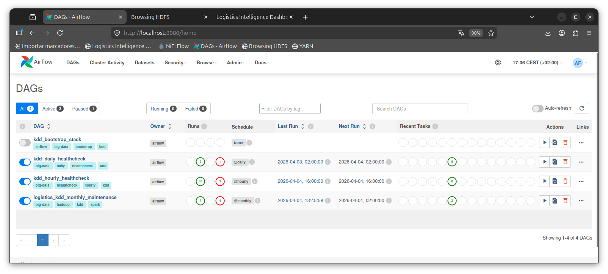

# Operaciones del Proyecto KDD

## Portada

- Proyecto: `Proyecto Big Data KDD - Logistica`
- Documento: `Guia de operaciones y troubleshooting`
- Version: `v1.4`
- Fecha: `04/04/2026`
- Repositorio GitHub: `https://github.com/raulsistemasydesarrollo/KDD-Ingenieria-de-datos`

## Indice

1. Arranque y parada
2. Comandos operativos rapidos (scripts clave)
3. Healthcheck en Airflow
4. Arranque del stack desde Airflow
5. Flujo NiFi
6. Validaciones
7. Politica de almacenamiento
8. Matriz operativa end-to-end
9. Limpieza de estado streaming
10. Limpieza de historico failed en Airflow
11. Zona horaria
12. Vistas Hive en hora Madrid
13. Bitacora operativa
14. Operacion del dashboard (estado final)
15. Troubleshooting dashboard
16. Sync de insights Cassandra -> Hive
17. Reentreno IA del dashboard
18. Preview HDFS en navegador (temporal y riesgos)

Este documento resume los comandos recomendados para operar el entorno y validar resultados.

Manual de usuario integral relacionado:

- `docs/manual-usuario.md`

## Arranque y parada

Arrancar todo el stack:

```bash
./scripts/start_kdd.sh
```

El script de arranque incluye automaticamente:

1. bootstrap de NiFi,
2. `ensure_hive_streaming_compat.sh` (recreacion idempotente de tablas/vistas streaming Hive),
3. sanity check Hive streaming (tablas + vistas Madrid + `COUNT(*)` de ambas vistas),
4. repoblado de `transport_analytics.weather_observations_streaming` desde Cassandra si `v_weather_observations_madrid` queda en `0` filas.

Parar todo el stack:

```bash
./scripts/stop_kdd.sh
```

## Comandos operativos rapidos (scripts clave)

### Reinicio completo o parcial de servicios

Reinicio completo (recomendado para demos):

```bash
./scripts/stop_kdd.sh
./scripts/start_kdd.sh
```

Reinicio de servicio puntual:

```bash
docker compose restart dashboard
docker compose restart nifi
docker compose restart spark-client
```

Recrear servicio con nueva imagen/config:

```bash
sg docker -c "docker compose up -d --build --force-recreate dashboard"
```

### Checks de salud de la plataforma

Health HTTP de dashboard:

```bash
curl -fsS http://localhost:8501/health
```

Estado general de contenedores:

```bash
docker compose ps
```

Healthcheck Airflow (API interna):

```bash
curl -fsS http://localhost:8080/health
```

Estado de topics Kafka:

```bash
docker compose exec -T kafka /opt/kafka/bin/kafka-topics.sh --bootstrap-server kafka:9092 --list | sort
```

Comprobacion de rutas HDFS:

```bash
docker compose exec -T hadoop hdfs dfs -ls -R /data/raw/nifi | tail -n 40
docker compose exec -T hadoop hdfs dfs -ls -R /data/curated | tail -n 60
```

### Comprobaciones y validaciones por script

Validacion E2E de Hive (batch + streaming):

```bash
./scripts/validate_hive_pipeline.sh
```

Validacion de parseo meteo (number/string -> double):

```bash
./scripts/validate_weather_parsing_fix.sh
```

Reparacion idempotente de objetos streaming en Hive:

```bash
./scripts/ensure_hive_streaming_compat.sh
```

Repoblado meteo en Hive desde Cassandra:

```bash
./scripts/repopulate_hive_weather_from_cassandra.sh
```

### Consultas BBDD (Hive y Cassandra)

Hive: tablas y recuentos clave:

```bash
docker compose exec -T spark-client spark-sql -e "SHOW TABLES IN transport_analytics;"
docker compose exec -T spark-client spark-sql -e "SELECT COUNT(*) AS delay_rows FROM transport_analytics.v_delay_metrics_streaming_madrid;"
docker compose exec -T spark-client spark-sql -e "SELECT COUNT(*) AS weather_rows FROM transport_analytics.v_weather_observations_madrid;"
```

Cassandra: estado de flota, meteo e insights:

```bash
docker compose exec -T cassandra cqlsh -e "SELECT vehicle_id, warehouse_id, route_id, last_event_timestamp, delay_minutes, speed_kmh FROM transport.vehicle_latest_state LIMIT 20;"
docker compose exec -T cassandra cqlsh -e "SELECT bucket, weather_timestamp, weather_event_id, warehouse_id, temperature_c, precipitation_mm, wind_kmh FROM transport.weather_observations_recent WHERE bucket='all' LIMIT 20;"
docker compose exec -T cassandra cqlsh -e "SELECT bucket, entity_type, profile, min_congestion, snapshot_time, rank, entity_id, impact_score, criticality_score FROM transport.network_insights_snapshots LIMIT 20;"
```

### Troubleshooting rapido

Limpiar estado streaming (tablas + checkpoints) y recomponer vistas:

```bash
./scripts/reset_streaming_state.sh
```

Reset de demo (soft / hard):

```bash
./scripts/reset_demo_data.sh
./scripts/reset_demo_data.sh --hard
```

Limpieza de runs `failed` en Airflow:

```bash
./scripts/cleanup_airflow_failed_runs.sh
./scripts/cleanup_airflow_failed_runs.sh --apply
```

Reconstruir flujo NiFi y limpiar PGs legacy:

```bash
./scripts/bootstrap_nifi_flow.sh
./scripts/cleanup_nifi_legacy_pgs.py
```

Preview HDFS desde navegador (sin tocar HDFS interno):

```bash
./scripts/toggle_hdfs_browser_preview_hosts.sh status
sudo ./scripts/toggle_hdfs_browser_preview_hosts.sh enable
```

## Healthcheck en Airflow

Captura de la vista operativa de Airflow:



Se incorporan dos DAGs de comprobacion:

- `kdd_daily_healthcheck`
- `kdd_hourly_healthcheck`

Estos DAGs validan:

1. Contenedores core activos (`kafka`, `hadoop`, `hive-metastore`, `nifi`, `spark-client`).
2. Topics Kafka necesarios (`transport.filtered`, `transport.weather.filtered`).
3. Paths base de HDFS.
4. Tablas Hive base de `transport_analytics`.
5. Vistas en hora Madrid:
   - `transport_analytics.v_weather_observations_madrid`
   - `transport_analytics.v_delay_metrics_streaming_madrid`
6. Consulta smoke de ambas vistas (con degradacion segura):
   - si las tablas streaming fuente no estan disponibles temporalmente, el smoke no rompe el DAG y valida metastore/batch.
7. Auto-recuperacion meteo:
   - tarea `repopulate_hive_weather_if_empty`,
   - si `weather_rows=0` en `v_weather_observations_madrid`, ejecuta `./scripts/repopulate_hive_weather_from_cassandra.sh` antes del smoke query de meteo.

Alertas:

- Cada DAG incluye `on_failure_callback` (alerta en logs de Airflow).
- Si defines `AIRFLOW_ALERT_EMAIL`, se habilita envio de email en fallo.

## Arranque del stack desde Airflow

DAG de bootstrap:

- `kdd_bootstrap_stack`

Este DAG arranca servicios no-Airflow del stack (`kafka`, `nifi`, `gps-generator`, `hadoop`, `raw-hdfs-loader`, `postgres-metastore`, `hive-metastore`, `cassandra`, `spark-client`, `dashboard`) y muestra estado final.

Script recomendado (arranca Airflow y dispara el DAG):

```bash
./scripts/start_airflow_then_stack.sh
```

## Flujo NiFi

Bootstrap automatico del flujo de ingesta:

```bash
./scripts/bootstrap_nifi_flow.sh
```

Estructura visual creada por defecto:

- Process Group: `kdd_ingestion_auto_v9`
- Subgrupos:
  - `gps_ingestion`
  - `weather_ingestion`
- Archivado GPS:
  - `SplitText` + `UpdateAttribute` + `PutFile` con filename unico por split (`${filename}_${fragment.index}_${UUID()}.jsonl`).

Limpieza de grupos legacy (para dejar solo la version actual):

```bash
./scripts/cleanup_nifi_legacy_pgs.py
```

## Validaciones

Validacion E2E principal (batch + streaming):

```bash
./scripts/validate_hive_pipeline.sh
```

Validacion especifica del parseo meteo (soporta numeros y numeros como string):

```bash
./scripts/validate_weather_parsing_fix.sh
```

## Politica de almacenamiento

El proyecto sigue el criterio recomendado:

- Capa `raw`: conservar entrada original en `JSON/JSONL` para trazabilidad y reprocesado.
- Capa `curated`: persistir salida transformada en `Parquet` para analitica eficiente.

Rutas principales:

- Raw en HDFS:
  - `/data/raw/gps_events.jsonl`
  - `/data/raw/nifi/...`
- Curated en HDFS:
  - `/data/curated/enriched_events`
  - `/data/curated/delay_metrics_streaming`
  - `/data/curated/weather_observations_streaming`
  - `/data/curated/enriched_events_streaming`

Comprobacion de rutas y formatos:

```bash
sg docker -c "docker compose exec -T hadoop hdfs dfs -ls -R /data/raw | head -n 50"
sg docker -c "docker compose exec -T hadoop hdfs dfs -ls -R /data/curated | head -n 100"
```

Comprobacion SQL en Hive:

```bash
sg docker -c "docker compose exec -T spark-client spark-sql -e \"SHOW TABLES IN transport_analytics;\""
sg docker -c "docker compose exec -T spark-client spark-sql -e \"DESCRIBE FORMATTED transport_analytics.enriched_events;\""
```

## Consultas desde terminal (Hive y Cassandra)

### Hive (via spark-sql en `spark-client`)

Listar tablas del esquema:

```bash
docker compose exec -T spark-client spark-sql -e "SHOW TABLES IN transport_analytics;"
```

Ver estructura de una tabla:

```bash
docker compose exec -T spark-client spark-sql -e "DESCRIBE transport_analytics.delay_metrics_streaming;"
```

Consultar ultimos registros (primero valida que haya filas):

```bash
docker compose exec -T spark-client spark-sql -e "SELECT COUNT(*) AS weather_rows FROM transport_analytics.v_weather_observations_madrid;"
docker compose exec -T spark-client spark-sql -e "SELECT weather_event_id, weather_timestamp_utc, weather_timestamp_madrid, warehouse_id, temperature_c, precipitation_mm, wind_kmh FROM transport_analytics.v_weather_observations_madrid WHERE weather_timestamp_utc IS NOT NULL ORDER BY weather_timestamp_utc DESC LIMIT 20;"
```

Si `weather_rows = 0`, la vista existe pero no hay carga streaming meteo en Hive en ese momento.
Como consulta operativa inmediata usa Cassandra:

```bash
docker compose exec -T cassandra cqlsh -e "SELECT bucket, weather_timestamp, weather_event_id, warehouse_id, temperature_c, precipitation_mm, wind_kmh FROM transport.weather_observations_recent WHERE bucket='all' LIMIT 20;"
```

Para repoblar Hive meteo desde Cassandra:

```bash
./scripts/repopulate_hive_weather_from_cassandra.sh
```

Comprobar si existe la tabla streaming fisica (puede no existir y seguir siendo correcto en este proyecto):

```bash
docker compose exec -T spark-client spark-sql -e "SHOW TABLES IN transport_analytics LIKE 'weather_observations_streaming';"
```

Reparar/asegurar objetos streaming de Hive (tablas + vistas Madrid) tras limpiezas:

```bash
./scripts/ensure_hive_streaming_compat.sh
```

Sanity check manual (equivalente al que ejecuta `start_kdd.sh`):

```bash
docker compose exec -T spark-client spark-sql -e "
SHOW TABLES IN transport_analytics LIKE 'delay_metrics_streaming';
SHOW TABLES IN transport_analytics LIKE 'enriched_events_streaming';
SHOW TABLES IN transport_analytics LIKE 'weather_observations_streaming';
SHOW TABLES IN transport_analytics LIKE 'v_delay_metrics_streaming_madrid';
SHOW TABLES IN transport_analytics LIKE 'v_weather_observations_madrid';
SELECT COUNT(*) AS delay_rows FROM transport_analytics.v_delay_metrics_streaming_madrid;
SELECT COUNT(*) AS enriched_stream_rows FROM transport_analytics.enriched_events_streaming;
SELECT COUNT(*) AS weather_rows FROM transport_analytics.v_weather_observations_madrid;
"
```

### Cassandra (via `cqlsh` en contenedor `cassandra`)

Listar keyspaces:

```bash
docker compose exec -T cassandra cqlsh -e "DESCRIBE KEYSPACES;"
```

Listar tablas del keyspace `transport`:

```bash
docker compose exec -T cassandra cqlsh -e "DESCRIBE TABLES IN transport;"
```

Ver definicion de tabla:

```bash
docker compose exec -T cassandra cqlsh -e "DESCRIBE TABLE transport.vehicle_latest_state;"
```

Consultar estado de flota:

```bash
docker compose exec -T cassandra cqlsh -e "SELECT vehicle_id, warehouse_id, route_id, last_event_timestamp, delay_minutes, speed_kmh FROM transport.vehicle_latest_state LIMIT 20;"
```

Consultar clima reciente:

```bash
docker compose exec -T cassandra cqlsh -e "SELECT weather_timestamp, warehouse_id, temperature_c, precipitation_mm, wind_kmh FROM transport.weather_observations_recent WHERE bucket='all' LIMIT 20;"
```

Consultar snapshots de insights de red:

```bash
docker compose exec -T cassandra cqlsh -e "SELECT bucket, entity_type, profile, min_congestion, snapshot_time, rank, entity_id, impact_score, criticality_score FROM transport.network_insights_snapshots LIMIT 20;"
```

## Sync de insights Cassandra -> Hive

Para consolidar snapshots de insights en Hive:

```bash
sg docker -c "docker compose exec -T spark-client /opt/spark-app/run-insights-sync.sh"
```

Tablas resultantes en Hive:

- `transport_analytics.network_insights_snapshots_hive`
- `transport_analytics.network_insights_hourly_trends`

Validacion rapida:

```bash
docker compose exec -T spark-client spark-sql -e "SELECT COUNT(*) AS c FROM transport_analytics.network_insights_snapshots_hive;"
docker compose exec -T spark-client spark-sql -e "SELECT snapshot_hour, profile, min_congestion, top_edge_id, top_node_id FROM transport_analytics.network_insights_hourly_trends ORDER BY snapshot_hour DESC LIMIT 20;"
```

Si aparece error `permission denied` al ejecutar `run-insights-sync.sh`:

```bash
chmod +x spark-app/run-insights-sync.sh
sg docker -c "docker compose up -d --build spark-client"
```

## Matriz operativa end-to-end

Tabla de referencia rapida para trazar cada flujo desde origen hasta consumo analitico:

| Flujo | Fuente | Kafka | HDFS | Hive |
|---|---|---|---|---|
| GPS raw | `gps-generator` -> NiFi (`nifi/input/*.jsonl`) | `transport.raw` | `/data/raw/nifi/gps/...` | No aplica (capa raw) |
| GPS filtrado/normalizado | NiFi | `transport.filtered` | `/data/curated/delay_metrics_streaming` (fallback parquet streaming) | `transport_analytics.delay_metrics_streaming` |
| GPS enriquecido streaming | Spark streaming | `transport.filtered` | `/data/curated/enriched_events_streaming` (fallback parquet streaming) | `transport_analytics.enriched_events_streaming` |
| Weather raw | API Open-Meteo -> NiFi | `transport.weather.raw` | `/data/raw/nifi/weather/...` | No aplica (capa raw) |
| Weather filtrado/normalizado | NiFi | `transport.weather.filtered` | `/data/curated/weather_observations_streaming` (fallback parquet streaming) | `transport_analytics.v_weather_observations_madrid` (vista operativa) |
| Batch historico GPS | HDFS seed/raw (`/data/raw/gps_events.jsonl`) | No aplica | `/data/curated/enriched_events` | `transport_analytics.enriched_events`, `transport_analytics.delay_metrics_batch`, `transport_analytics.route_graph_metrics` |
| Grafo shortest path | `data/graph/*` (batch Spark) | No aplica | No aplica (tabla Hive) | `transport_analytics.route_shortest_paths` |
| ML riesgo retraso | `enriched_events` (batch Spark ML) | No aplica | `hdfs://hadoop:9000/models/delay_risk_rf` (modelo) | `transport_analytics.ml_delay_risk_scores` |

Validacion ML (batch/reentreno) recomendada:

```bash
sg docker -c "docker compose exec -T spark-client bash /opt/spark-app/run-batch.sh"
sg docker -c "docker compose exec -T hadoop hdfs dfs -du -h /models/delay_risk_rf"
```

Salida esperada (iteracion 04/04/2026):

- linea en logs con comparativa:
  - `INFO: ML A/B delay risk => baseline_rmse=... | tuned_baseline_rmse=... | enhanced_rmse=... | selected=...`
- modelo persistido en `hdfs://hadoop:9000/models/delay_risk_rf` con tamano ~`1.2 MB` (estado validado 04/04/2026).

Checklist de comprobacion rapida:

```bash
sg docker -c "docker compose exec -T kafka /opt/kafka/bin/kafka-topics.sh --bootstrap-server kafka:9092 --list | sort"
sg docker -c "docker compose exec -T hadoop hdfs dfs -ls -R /data/raw/nifi | tail -n 40"
sg docker -c "docker compose exec -T hadoop hdfs dfs -ls -R /data/curated | tail -n 60"
sg docker -c "docker compose exec -T spark-client spark-sql -e \"SHOW TABLES IN transport_analytics;\""
```

## Limpieza de estado streaming

Elimina tablas de streaming en Hive y checkpoints en HDFS para arrancar limpio:

```bash
./scripts/reset_streaming_state.sh
```

## Limpieza de historico failed en Airflow

Para limpiar runs fallidos antiguos (sin tocar runs `success`):

```bash
./scripts/cleanup_airflow_failed_runs.sh
```

Aplicar borrado:

```bash
./scripts/cleanup_airflow_failed_runs.sh --apply
```

Estado esperado tras limpieza:

- Sin `failed` para:
  - `kdd_daily_healthcheck`
  - `kdd_hourly_healthcheck`

Comprobacion SQL directa en metastore de Airflow:

```bash
docker exec airflow-postgres psql -U airflow -d airflow -c "
SELECT dag_id, count(*) AS failed_runs
FROM dag_run
WHERE state='failed'
  AND dag_id IN ('kdd_daily_healthcheck','kdd_hourly_healthcheck')
GROUP BY dag_id;"
```

## Zona horaria

- Spark usa por defecto `SPARK_SQL_TIMEZONE=Europe/Madrid`.
- Los eventos entran habitualmente con marca temporal UTC (`...Z`), por lo que puede ser util consultar tanto UTC como Madrid.

## Vistas Hive en hora Madrid

Vistas disponibles:

- `transport_analytics.v_weather_observations_madrid`
- `transport_analytics.v_delay_metrics_streaming_madrid`

Si una vista falla con `TABLE_OR_VIEW_NOT_FOUND`, ejecutar:

```bash
./scripts/ensure_hive_streaming_compat.sh
```

Consulta ejemplo meteo:

```sql
SELECT weather_event_id, weather_timestamp_utc, weather_timestamp_madrid
FROM transport_analytics.v_weather_observations_madrid
ORDER BY weather_timestamp_utc DESC
LIMIT 10;
```

Consulta ejemplo GPS agregado:

```sql
SELECT warehouse_id, window_start_utc, window_start_madrid, window_end_utc, window_end_madrid
FROM transport_analytics.v_delay_metrics_streaming_madrid
ORDER BY window_start_utc DESC
LIMIT 10;
```

## Bitacora operativa (actualizada 04/04/2026)

Cambios aplicados:

1. Healthchecks Airflow estabilizados frente a ausencia temporal de tablas streaming fuente.
2. Historial rojo de healthchecks limpiado en Airflow.
3. NiFi reorganizado por dominios (`gps_ingestion` y `weather_ingestion`) en `kdd_ingestion_auto_v9`.
4. Process Group legacy eliminado para evitar ruido visual en la UI de NiFi.
5. Incorporado flujo de insights de red con persistencia en Cassandra y sync a Hive.
6. Reentreno mensual endurecido contra paralelismo (`max_active_runs=1` en DAG mensual).
7. Dashboard muestra `Ultimo reentreno` y `Siguiente programado` en cabecera (hora Madrid).
8. Trigger manual de reentreno bloqueado cuando existe ejecucion activa desde Airflow (`409`).
9. Guia operativa de preview HDFS actualizada con opcion segura por `/etc/hosts` y riesgos del cambio temporal en `hdfs-site.xml`.

## Nota de tablas en tiempo real

- `transport_analytics.enriched_events` es historico batch.
- Para consultas en vivo de eventos enriquecidos usar `transport_analytics.enriched_events_streaming`.

## Operacion del dashboard (estado final)

### Desacople de vistas

El dashboard opera con dos contextos de filtro independientes:

1. `Operacion en Tiempo Real` (izquierda):
   - filtros: `Origen RT`, `Destino RT`.
2. `Analisis de Red Logistica` (derecha):
   - filtros: `Origen`, `Destino`, `Perfil`.

Un cambio de filtro en un bloque no debe alterar el otro.

Adicionalmente, en el estado actual:

1. Los selectores de origen/destino en ambas vistas se cargan ordenados alfabeticamente.
2. Todas las tablas del dashboard admiten ordenacion por columna.
3. Perfiles de ruta disponibles: `balanced`, `fastest`, `resilient`, `eco`, `low_risk`, `reliable`.
4. Controles de optimizacion activos:
   - pesos `tiempo/riesgo/eco`,
   - `Patron horario` (`auto`, `peak`, `offpeak`, `night`),
   - `Evitar nodos`.

### Reglas de filtro en Tiempo Real

- `TODOS -> TODOS`: muestra toda la flota.
- `TODOS -> X`: muestra vehiculos cuyo destino reportado es `X`.
- `X -> TODOS`: muestra vehiculos cuyo origen reportado es `X`.
- `X -> Y`: restringe por corredor y coherencia espacial.

### Fuente de ruta por vehiculo

Para evitar inconsistencias de inferencia:

1. Se usa plan de trayecto por vehiculo desde `nifi/input/.vehicle_path_state.json`.
2. Ese plan se expone por API en cada item como:
   - `planned_origin`
   - `planned_destination`
   - `planned_route_nodes`
   - `planned_route_label`
3. El frontend prioriza estos campos para `Ruta reportada`, `Siguiente nodo` y linea de proyeccion de ruta restante.

## Troubleshooting dashboard

### Caso: veo ruta incoherente (`X -> X`) o destino inesperado

1. Forzar recarga de navegador:

```bash
# navegador
Ctrl+F5
```

2. Comprobar payload de vehiculos:

```bash
docker compose exec -T dashboard python -c "import json,urllib.request;d=json.load(urllib.request.urlopen('http://127.0.0.1:8501/api/vehicles/latest?limit=10'));print([{k:i.get(k) for k in ('vehicle_id','warehouse_id','planned_origin','planned_destination','planned_route_label')} for i in d.get('items',[])])"
```

3. Verificar estado del plan del generador:

```bash
python3 - <<'PY'
import json
with open('nifi/input/.vehicle_path_state.json','r',encoding='utf-8') as f:
    d=json.load(f)
print(d.get('V1'))
PY
```

Si `planned_origin/planned_destination` o `planned_route_nodes` no aparecen en API, reiniciar dashboard:

```bash
docker compose restart dashboard
```

### Caso: ETA incoherente (ejemplo: >300 km y ETA en pocos minutos)

Comprobar primero distancia y velocidad mostradas en el panel de vehiculo.
Si son coherentes entre si pero la ETA no lo es:

1. Forzar recarga fuerte del frontend (`Ctrl+F5`) y pulsar `Actualizar` en el dashboard.
2. Verificar que el frontend ya incluye el ajuste de resincronizacion de ETA:

```bash
rg -n "forceResync|divergence|destinationChanged" dashboard/static/app.js
```

3. Reiniciar el servicio dashboard para limpiar estado en memoria:

```bash
docker compose restart dashboard
```

Nota tecnica:
- El calculo ETA ahora fuerza resincronizacion inmediata cuando hay cambio de destino estimado o desviacion grande entre ETA cacheado y ETA fisico (`distance/speed + delay`), evitando ETAs irreales persistentes.

## Reentreno IA del dashboard

El dashboard expone operativa de reentreno de modelo desde la cabecera.

Bloques de cabecera en estado actual:

1. Panel izquierdo: `EN USO`, candidato elegido (`A/B/C`) y comparativa RMSE.
2. Panel derecho: descripcion de los 3 candidatos en columna unica.
3. Bloque de calendario sobre el boton:
   - `Ultimo reentreno`
   - `Siguiente programado`
   - mostrado en `Europe/Madrid`.

### Endpoints

- Trigger manual:

```bash
curl -s -X POST http://localhost:8501/api/ml/retrain \
  -H 'Content-Type: application/json' \
  -d '{"trigger":"manual_dashboard"}'
```

- Estado + recomendacion:

```bash
curl -s http://localhost:8501/api/ml/retrain/status
```

Respuesta ampliada:

- `state`
- `advice`
- `model_info`
- `schedule_info` (`last_retrain_at`, `next_scheduled_at`, `timezone`)

### Variables de entorno relevantes

- `RETRAIN_COMMAND` (por defecto: `docker exec spark-client /opt/spark-app/run-batch.sh`)
- `RETRAIN_TIMEOUT_SECONDS`
- `RETRAIN_RECOMMEND_THRESHOLD`
- `RETRAIN_RECOMMEND_ON_THRESHOLD`
- `RETRAIN_RECOMMEND_OFF_THRESHOLD`
- `RETRAIN_COOLDOWN_HOURS`
- `RETRAIN_STATUS_POLL_CACHE_SECONDS`
- `CASSANDRA_RETRAIN_STATE_TABLE` (por defecto: `model_retrain_state`)

### Persistencia Cassandra

Tabla de estado de recomendacion/reentreno:

```bash
docker compose exec -T cassandra cqlsh -e "SELECT model_name, last_success_at, last_run_at, last_status, last_recommendation, last_score, last_selected_model, last_selected_rmse, last_baseline_rmse, last_tuned_baseline_rmse, last_enhanced_rmse, updated_at FROM transport.model_retrain_state;"
```

### Concurrencia y bloqueo de triggers

1. El DAG mensual `logistics_kdd_monthly_maintenance` opera con `max_active_runs=1`.
2. Si existe reentreno en curso (dashboard o Airflow), `POST /api/ml/retrain` devuelve `409`.
3. El estado compartido permite que la cabecera refleje `running` cuando el trigger viene desde Airflow.

## Preview HDFS en navegador (temporal y riesgos)

Contexto:

- En NameNode UI (`http://localhost:9870`) puede aparecer `Couldn't preview the file`.
- Suele deberse a redirect a `http://hadoop:9864/...` que el host no resuelve.

Camino recomendado (estable):

```bash
sudo ./scripts/toggle_hdfs_browser_preview_hosts.sh enable
```

Revertir:

```bash
sudo ./scripts/toggle_hdfs_browser_preview_hosts.sh disable
```

Implicaciones del recomendado:

1. Solo modifica `/etc/hosts` del host.
2. No toca `hdfs-site.xml`.
3. No afecta Spark/Airflow internos.

Cambio temporal alternativo (solo prueba puntual, no recomendado):

1. Ajustar `docker/hadoop/conf/hdfs-site.xml` con:
   - `dfs.datanode.hostname=localhost`
   - `dfs.client.use.datanode.hostname=true`
   - `dfs.datanode.use.datanode.hostname=true`
2. Rebuild/recreate de `hadoop`.

Implicaciones del alternativo:

1. Puede mejorar preview web desde host.
2. Puede romper escrituras HDFS desde contenedores Spark/Airflow:
   - `Connection refused`
   - `could only be written to 0 of the 1 minReplication nodes`
3. Debe revertirse tras la prueba.
